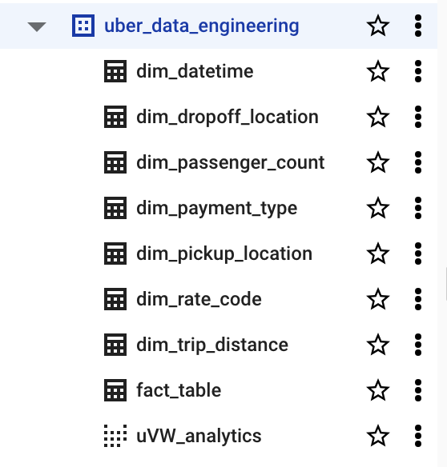

# Uber Data Analytics | Modern Data Engineering GCP Project

## Introduction

Welcome to the Uber Data Analytics project, a modern data engineering endeavor that delves into Uber data using a diverse set of tools and technologies. We leverage Google Cloud Platform (GCP), Python, Compute Instances, Mage Data Pipeline Tool, BigQuery, and Looker Studio to extract valuable insights from this dataset. This README will provide you with a detailed overview of the project's architecture, technologies, and the critical role played by BigQuery Tables.

## Technologies Utilized

We have employed the following technologies in this project:

- **Programming Language**: Python
- **Google Cloud Platform (GCP)**:
  1. **Google Storage**: For storing various data files and artifacts.
  2. **Compute Instance**: Used for computation and processing tasks.
  3. **BigQuery**: The heart of our data analytics, where we store, query, and analyze the Uber dataset.
  4. **Looker Studio**: A powerful tool for visualizing and reporting on our data.
- **Modern Data Pipeline Tool**: [Mage Data Pipeline Tool](https://www.mage.ai/)

BigQuery Tables play a pivotal role in this project, enabling efficient storage and analysis of our dataset. These tables are designed to optimize query performance and facilitate complex data transformations. Below, we delve into the significance of BigQuery Tables and how they enhance our data analytics pipeline.

### BigQuery Tables

BigQuery Tables serve as the central repository for our Uber dataset. They are structured to accommodate the various data fields, allowing us to run SQL-like queries to extract meaningful insights. These tables are highly scalable, enabling us to handle large volumes of data efficiently. Whether you need to calculate ride statistics, analyze trip patterns, or assess driver performance, BigQuery Tables are the cornerstone of our data processing.

Each table is meticulously designed, following the schema of our dataset, and organized to streamline our analytical workflows. Whether you are a data analyst, data scientist, or a business stakeholder, the structured nature of our BigQuery Tables simplifies the process of extracting the information you need.

## Dataset Used

We are working with the TLC Trip Record Data, encompassing trip records from both yellow and green taxis. This dataset includes essential fields such as pick-up and drop-off dates/times, locations, distances, fares, rate types, payment methods, and passenger counts reported by drivers.

You can access the dataset used in this project [here](https://github.com/darshilparmar/uber-etl-pipeline-data-engineering-project/blob/main/data/uber_data.csv).

For more details about the dataset, please refer to the following resources:
1. **Website**: [NYC TLC Trip Record Data](https://www.nyc.gov/site/tlc/about/tlc-trip-record-data.page)
2. **Data Dictionary**: [Data Dictionary for Trip Records](https://www.nyc.gov/assets/tlc/downloads/pdf/data_dictionary_trip_records_yellow.pdf)

# Thanks for your time! 😃
